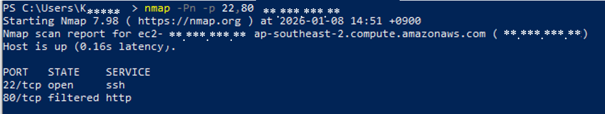
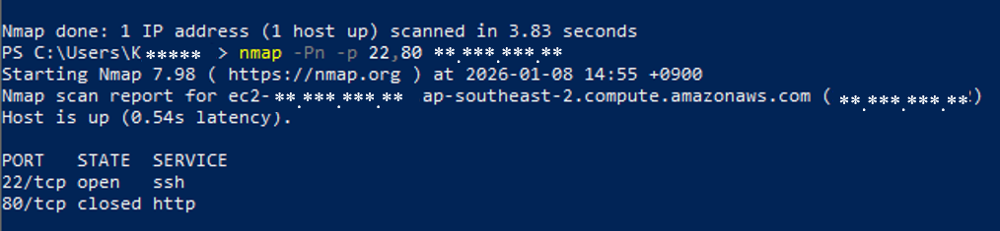
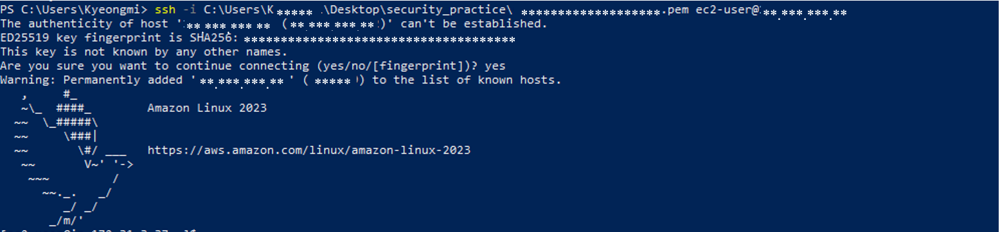
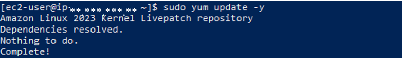
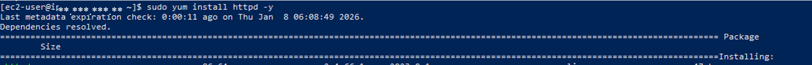
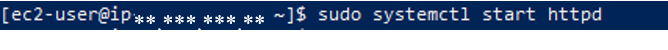
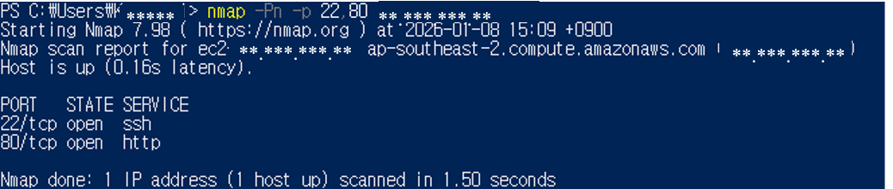
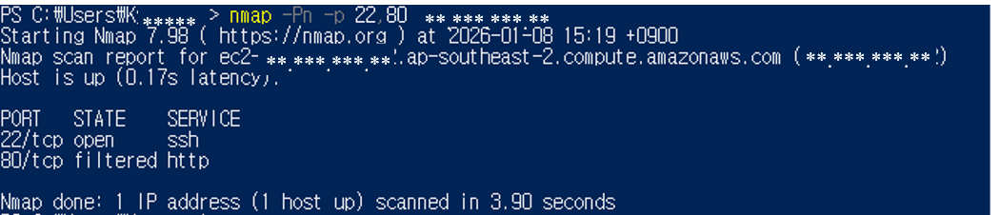

# ec2-network-security

## 1. 목적

AWS EC2 환경에서 보안 그룹을 활용하여
서버 인바운드 규칙 수정을 통해 포트 접근을 제어하고,
외부에서 nmap 스캔을 통해 실제 포트 노출 상태를 검증한다.

## 2. 환경

- Cloud: AWS EC2
- OS: Amazon Linux 2
- Client OS: Windows 10 (PowerShell)
- Tool: nmap
 2 
## 3. 수행

### (1) 초기상태

- EC2 인스턴스 생성
- 보안 그룹 인바운드 규칙:
  - SSH (22) : 허용 (내 IP)

### (2) 22, 80 포트에 대한 상태 확인

```bash
nmap -Pn -p 22, 80 <EC2-PUBLIC-IP>
```

```bash
22/tcp  open     ssh
80/tcp  filtered http
```
EC2 보안 그룹에서 ICMP 요청이 차단되어 있어
기본 nmap 스캔 시 Host down으로 표시되었으며,
-Pn 옵션을 사용해 실제 포트 상태를 확인하였다.



### (3) HTTP 포트 허용 테스트

- 보안 그룹에서 HTTP(80) 포트를 0.0.0.0/0으로 허용 (인바운드 규칙 추가)
- nmap 재검사

```bash
nmap -Pn -p 22, 80 <EC2-PUBLIC-IP>
```

```bash
22/tcp  open     ssh
80/tcp  closed   http
```

- 열려 있는 서비스가 없기 때문에 80 포트를 열어도 응답할 프로그램이 없음



### (4) ssh 접속하여 서비스(웹 서버) 띄우기

```bash
ssh -i <EC2-key>.pem ec2-user@<EC2_PUBLIC_IP>
```
- ssh 접속

```bash
sudo yum update -y
sudo yum install httpd -y
sudo systemctl start httpd
```
- 웹 서버 설치 및 실행






### (5) HTTP 포트 허용 재 테스트
```bash
nmap -Pn -p 22, 80 <EC2-PUBLIC-IP>
```

```bash
22/tcp  open     ssh
80/tcp  open     http
```



### (6) HTTP 인바운드 규칙 제거
- 인바운드 규칙 제거 및 nmap 재확인
```bash
nmap -Pn -p 22, 80 <EC2-PUBLIC-IP>
```

```bash
22/tcp  open     ssh
80/tcp  filtered http
```



### (7) 서버 내 서비스 정리
```bash
sudo systemctl stop httpd
sudo systemctl disable httpd
```

## 4. 요약
- 클라우드 환경에서의 접근 제어 구조를 이해
- 보안 그룹을 통해 외부 네트워크 접근 제한
- 실제 서비스가 실행되지 않으면 포트가 열려 있어도 외부에서 접근할 수 없음을 확인 (closed)
- nmap을 활용해 외부 관점에서 포트 노출 상태(open/closed/filtered)를 검증
- 서버 보안 설정과 네트워크 보안을 함께 고려해야 함