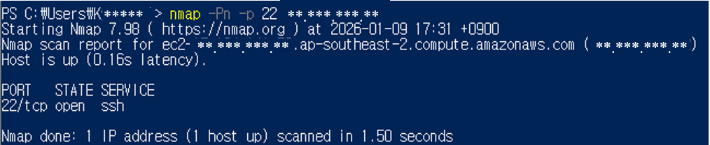
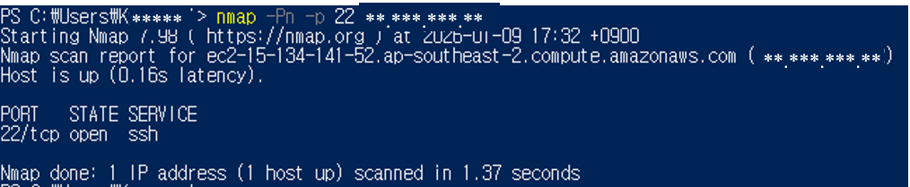
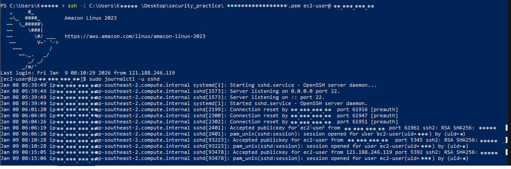
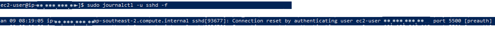

# ssh-access-control

## 1. 목적

AWS EC2 환경에서 SSH(22) 포트에 대한 접근 제어를 설정하고, 보안 그룹의 IP 제한 설정에 따른 접근 차이를 확인한다. 또한 서버 내부 인증 로그를 통해 실제 접속 시도를 검증한다.

## 2. 환경

- Cloud: AWS EC2
- OS: Amazon Linux 2
- Client OS: Windows 10 (PowerShell)
- Tool: nmap, journalctl

## 3. 수행

### (1) 초기상태

- EC2 인스턴스 생성
- 보안 그룹 인바운드 규칙:
- SSH (22) : 허용 (내 IP)

### (2) SSH 포트 상태 확인

```bash
nmap -Pn -p 22 <EC2-PUBLIC-IP>
```

```bash
22/tcp  open     ssh
```
- SSH 포트는 오픈상태로 확인되었으나, 접근 가능한 IP 는 보안그룹에 의해 제한됨 (내 IP)



### (3) SSH 접근 범위 확장 테스트 (위험 설정)

- 보안 그룹에서 SSH(22) 포트를 0.0.0.0/0으로 허용
- nmap 재검사

```bash
nmap -Pn -p 22 <EC2-PUBLIC-IP>
```

```bash
22/tcp  open     ssh
```

- nmap 결과는 동일하지만, 모든 외부 IP에서 SSH 접근이 가능한 상태가 됨



### (4) SSH 접근 제한 복구
- SSH(22) 인바운드 규칙을 내 IP로 제한

### (5) 서버 내부 SSH 인증 로그 확인

```bash
ssh -i <EC2-key>.pem ec2-user@<EC2_PUBLIC_IP>

sudo journalctl -u sshd
```
- SSH 접속 시도가 서버 내부 로그에 기록됨
- systemd 기반 OS에서는 SSH 인증 로그가 /var/log/auth.log 대신 journalctl에 기록될 수 있음
- journalctl을 통해 확인



### (6) 일부러 실패 로그 만들기
```bash
ssh -i <wrong-key>.pem ec2-user@<EC2_PUBLIC_IP>
```
- 잘못된 SSH 키로 접속을 시도할 때 인증 단계 이전(preauth)에서
  서버가 연결을 차단하는 로그가 기록

  
  

## 요약
- SSH 포트는 open 상태이더라도 접근 범위(IP 제한)에 따라 보안 수준이 달라짐
- nmap 스캔만으로는 SSH 접근 제한 여부를 판단할 수 없음
- 서버 내부 인증 로그(journalctl)를 통해 실제 접근 시도를 확인
- 네트워크 보안과 서버 보안은 함께 고려되어야 함
- 불필요한 접근을 제한하여 공격 표면을 최소화해야 함