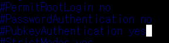
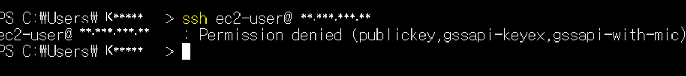
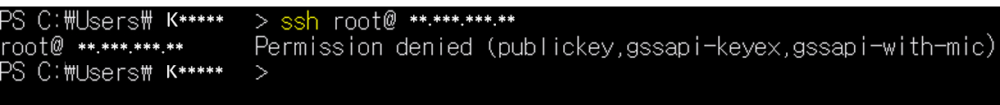
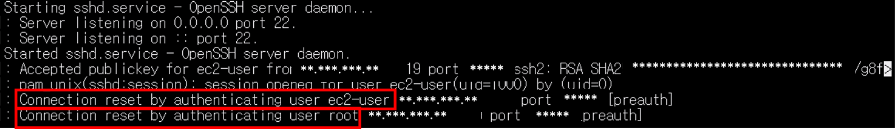

# ssh-hardening

## 1. 목적

AWS EC2 환경에서 SSH 기본 설정이 왜 위험할 수 있는지 이해하고, sshd_config 에서 로그인 설정 변경을 통해 보안을 강화한다.

## 2. 환경

- Cloud: AWS EC2
- OS: Amazon Linux 2
- Client OS: Windows 10 (PowerShell)
- Tool: ssh, journalctl

## 3. 수행

### (1) 현재 sshd_config 설정 백업

```bash
sudo cp /etc/sshd/sshd_config /etc/sshd/sshd_config.bak
```


### (2) sshd_config 설정 편집
- 설정 편집으로 진입


- PermitRootLogin no 설정으로 root 직접 접속 허용 여부를 비활성화
- PasswordAuthentication no 설정으로 비밀번호 로그인 비활성화
- PubkeyAuthentication yes 설정으로 pem 키 기반 로그인 유지



### (3) 설정 문법 체크
```bash
sudo sshd -t
```

### (4) SSH 데몬 재시작
- SSH 데몬을 재시작 하여 변경된 설정을 적용한다.
```bash
sudo systemctl restart sshd
```

### (5) 공격 시나리오 테스트
- 비밀번호 로그인 시도



- root 로그인 시도



### (6) 로그 확인
```bash
sudo journalctl -u sshd
```



- 로그를 통해 비밀번호 로그인과 root 로그인이 허용되지 않은 것을 확인할 수 있다.

## 요약
- 원격에서 공격을 통해 root 권한으로 접근하는 것을 막기 위해 root 로그인 차단
- 무차별 대입 공격 등 password 크래킹에 대비하기 위해 비밀번호를 통한 로그인 차단
- key 로그인의 경우 반드시 키 파일이 있어서 로그인 가능하기 때문에 해당 로그인 유지