# Web Server Security Hardening

## 1. 목적

AWS EC2 환경에서 Apache 웹 서버를 구축한 후 기본 설정 상태에서 발생할 수 있는 보안 취약점을 확인하고, 
보안 설정 적용 전/후를 비교하여 웹 서버 보안 하드닝을 수행하였다.  
Directory 섹션의 Options 지시자 내 -Indexes 설정을 통해 디렉터리 리스팅을 방지한다.   
ServerTokens 설정과 ServerSignature 설정을 통해 불필요한 서버 정보 노출을 차단한다.   


## 2. 환경

- Cloud: AWS EC2
- OS: Amazon Linux 2
- Client OS: Windows 10 (PowerShell)
- Tool: ssh, apache(httpd)

## 3. 수행

### (1) EC2 접속 후 아파치 웹서버 구동

```bash
sudo systemctl status httpd
```
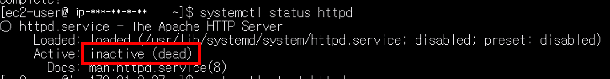
- httpd 가 inactive 상태임을 알 수 있다.

```bash
sudo systemctl start httpd
sudo systemctl status httpd 
```
- start 를 통해 httpd 를 구동하고 상태를 재확인한다.

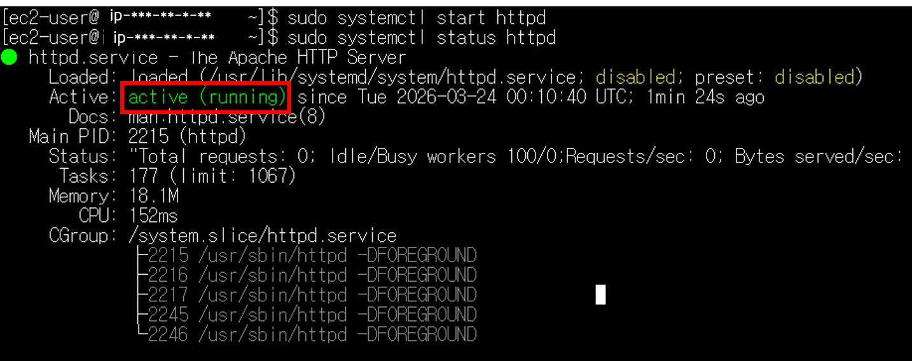
- active 상태임을 알 수 있다.

- 브라우저에서 EC2 Public IP 를 이용해 접근하여, 서버가 구동되고 있음을 확인한다.

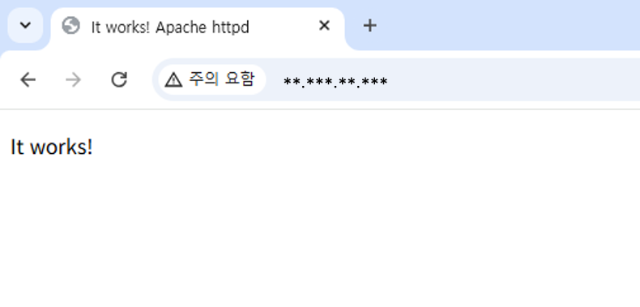

### (2) 현재 열린 포트 상태 확인
- EC2 안에서 열린 포트를 확인한다.
```bash
sudo ss -tuln
```
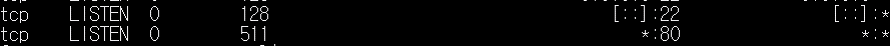

- 외부에서 nmap 을 통해 포트 스캔한다.
```bash
nmap -p 1-1000 EC2퍼블릭IP
```
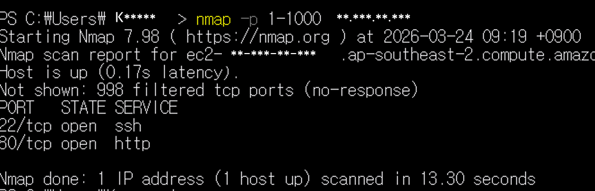

### (3) 디렉터리 리스팅 조치
- 브라우저에서 `http://EC2 IP/icons/` 접근을 통해 디렉터리 리스팅이 가능함을 확인한다.

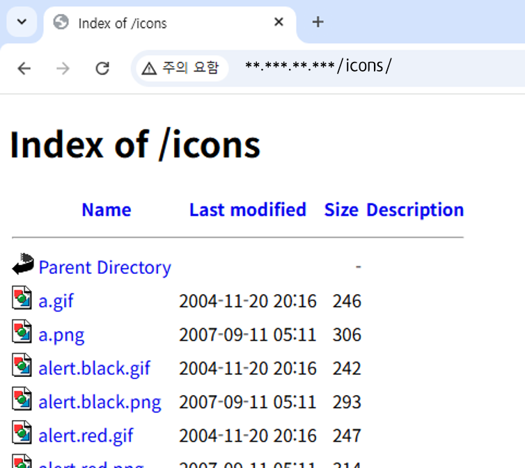

- Directory 섹션 Options -Indexes 설정을 통해 디렉터리 리스팅을 제한한다.
```bash
sudo nano /etc/httpd/conf.d/httpd.conf
```
- httpd.conf 파일에서 `<Directory "/var/www/html">` 스트링을 검색하여 Options 부분을 설정한다.

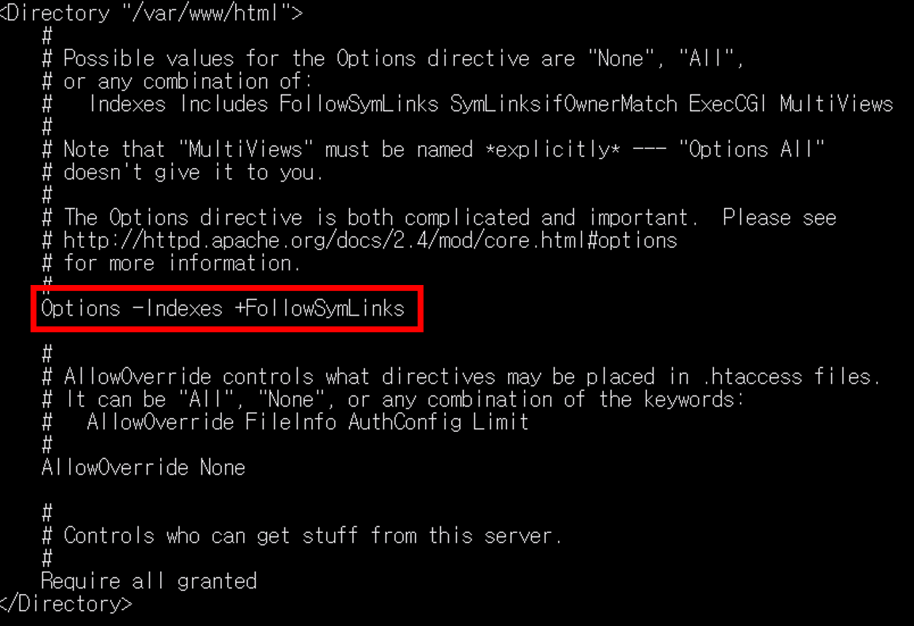

- 그 외 conf 파일에서 -Indexes 설정을 덮어쓰기 하고 있는 파일이 있는지 확인한다.
- 타 파일에서 해당 설정을 덮어쓰게 되면 httpd.conf 내에서 -Indexes 를 설정해도 디렉터리 리스팅이 가능하다.
```bash 
grep -R "Indexes" -n /etc/httpd
```
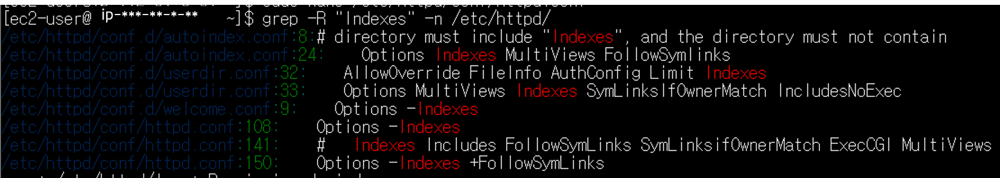

- 타 파일 내에도 -Indexes 설정을 해준다.

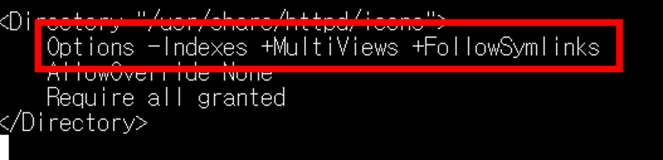

- httpd 데몬을 재가동한다.
```bash
sudo systemctl restart httpd
```
- `http://EC2 IP/icons/` 접근이 막힌 것을 확인한다.

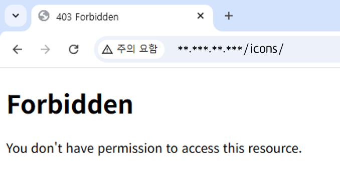

### (4) ServerTokens 및 ServerSignature 설정

- 요청 헤더를 확인한다.
```bash
curl -I http://EC2 IP
```
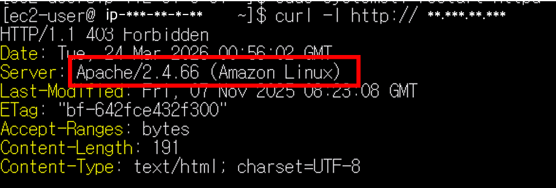

- 요청 헤더에 서버 정보 노출 수준을 결정하는 ServerTokens 정보를 설정한다.
  - 기본값은 OS 로 설정되어 있으며, 최소한의 정보만 제공하는 Prod 로 설정한다.
- 에러메시지 등에 서버 정보를 노출하는 ServerSignature 값을 Off 로 수정한다.
```bash
sudo nano /etc/httpd/conf.d/security.conf
```

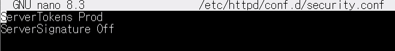

- 요청 헤더를 재확인 한다.

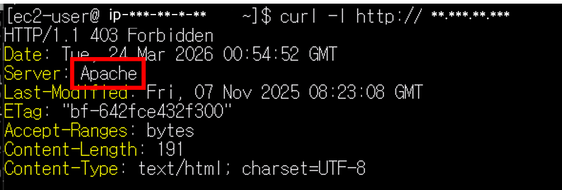

## 요약
- 브라우저에서 디렉터리 리스팅을 통해 서버 내 주요 자원이 노출되는 것을 방지하기 위해 Options -Indexes 설정
- ServerTokens 설정과 ServerSignature 설정을 통해 서버에 대한 과도한 정보가 노출되는 것을 방지
- 브라우저를 통한 아파치 서버 접근과 curl 명령을 이용한 요청헤더 확인으로 보안 설정이 정상 적용된 것을 검증