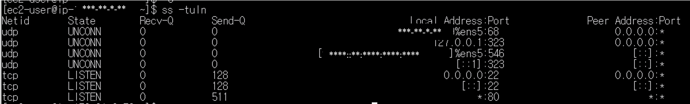
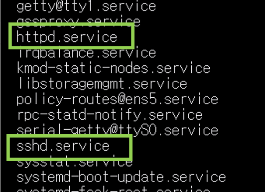
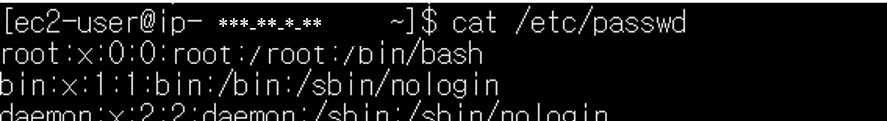
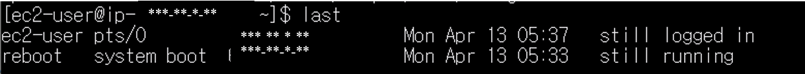
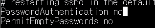

# linux server security check

## 1. 목적

다양한 명령어를 이용한 서버 점검을 통해 서버의 보안 상태를 확인한다.


## 2. 환경

- Cloud: AWS EC2
- OS: Amazon Linux 2
- Client OS: Windows 10 (PowerShell)
- Tool: ssh, apache(httpd)

## 3. 수행

### (1) 접근 가능한 포트 확인하기

```bash
ss -tuln
```

- 22번 포트와, 80번 포트에서 접근 가능함을 알 수 있다.
- 현재 실습 환경에서는 불필요한 추가 포트는 발견되지 않았다. 불필요 포트가 열려 있을 경우 공격 표면이 증가할 수 있으므로 최소한의 포트만 허용하는 것이 중요하다.

### (2) 불필요한 서비스 확인하기

```bash
systemctl list-units --type=service 
```

- httpd 와 sshd 서비스가 구동중임을 알 수 있다.

```bash
sudo systemctl stop <서비스명> 
```
- 불필요 서비스를 중단할 수 있다.

### (3) 사용자 계정 점검하기

```bash
cat /etc/passwd
```

- 불필요한 계정이 있는지 확인한다.
- 의도적인 권한 상승이 발생한 계정이 있는지 확인한다.

### (4) 최근 로그인 확인하기
```bash
last
```

- last 명령어를 통해 최근 로그인, 로그아웃 기록을 확인한다.
- 시스템 부팅, 셧다운 기록도 확인할 수 있다.

### (5) sshd 보안설정 확인하기
```bash
sudo nano /etc/ssh/sshd_config
```
   

- sshd_config 에서 `PermitRootLogin`값과 `PasswordAuthentication` 값을 `no`로 설정한다.
- `PermitRootLogin` 을 no 로 설정하면 root 계정의 원격 접속이 불가능하다.
  - root 계정의 원격 접속을 허용하지 않음으로써 불필요한 권한상승이나 root 권한의 셸 획득 가능성을 없앤다.
- `PasswordAuthentication` 을 no 로 설정하면 ssh 접속 시 패스워드를 통한 접속이 불가능하다. (.pem 없이 로그인 불가)
  - 패스워드를 통한 로그인을 불가능하게 하여 무차별대입 (Brute Force) 공격에 대비한다.

## 요약
- 다양한 명령어를 통해 서버 보안 상태를 점검한다.
- 서비스 포트 상태를 점검한다.
- 구동중인 서비스를 확인 및 중단한다.
- 사용자 계정을 점검하여 불필요한 계정을 삭제하고, 권한을 관리한다.
- sshd 보안 설정 점검을 통해 악의적인 접근 발생 가능성을 차단한다.
