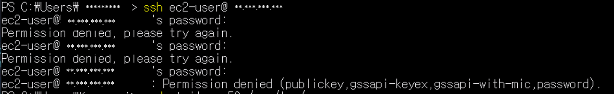
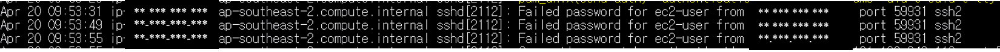
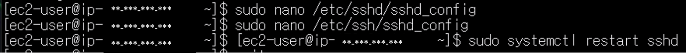
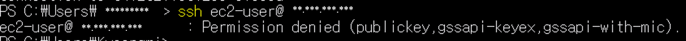

# ssh-attck-log-analysis

## 1. 목적

ec2 서버에 무차별 대입 공격을 발생 시키고, 로그를 분석한 후 sshd 설정을 통해 해당 공격을 방어한다.


## 2. 환경

- Cloud: AWS EC2
- OS: Amazon Linux 2
- Client OS: Windows 10 (PowerShell)
- Tool: ssh, apache(httpd)

## 3. 수행

### (1) 무차별 대입 공격 시뮬레이션

```bash
$ ssh ec2-user@[ip]
```
- 무작위 패스워드를 반복적으로 입력한다.


### (2) 로그 확인하기

```bash
$ sudo journalctl -u sshd
```
- ec2 접속한다.
- journalctl 을 이용하여 sshd 로그를 확인한다.


- `Failed Password` 구문을 통해 패스워드를 통한 로그인이 실패했음을 알 수 있다.
- 동일 IP에서 반복적인 로그인 실패 시도가 발생하였으며, 무차별 대입 공격(Brute Force Attack)의 특징으로 판단할 수 있다.

### (3) sshd 설정 점검하기

- password 를 통한 로그인이 열려 있으면 무차별 대입 공격으로 패스워드가 크래킹 될 수 있다.
- `PasswordAuthentication` 설정을 통해 패스워드 로그인을 막고, private key 를 이용해서만 로그인 가능하도록 설정한다.


- sshd 설정에서 `PasswordAuthentication` 항목을 `no`로 설정하고
- sshd 데몬 재가동

### (4) 패스워드 로그인 확인하기
```bash
$ ssh ec2-user@[ip]
```

- 초기에는 PasswordAuthentication이 활성화되어 있어 로그 상에 "Failed password" 이벤트가 다수 발생하였다.
- PasswordAuthentication을 비활성화한 후 비밀번호 기반 로그인 시도가 차단되며, 패스워드를 이용한 로그인 시도 시 시도 자체가 `denied` 되는 것을 확인할 수 있다.

## 요약
- sshd 설정 중 `PasswordAuthentication` 설정을 통해 무차별 대입 공격에 대비한다.
