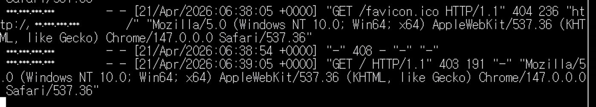
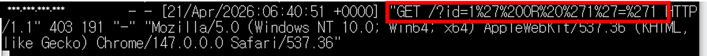
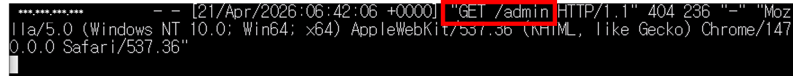
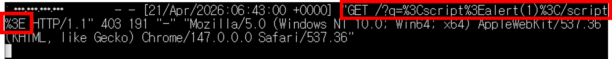

# web-attck-log-analysis

## 1. 목적

웹에서 발생할 수 있는 형태의 가상 공격 url 을 발생시키고, 로그를 분석한다.


## 2. 환경

- Cloud: AWS EC2
- OS: Amazon Linux 2
- Client OS: Windows 10 (PowerShell)
- Tool: ssh, apache(httpd)

## 3. 수행

### (1) httpd 실행 및 실시간 로그 확인

```bash
$ systemctl status httpd
$ sudo systemctl start httpd
```
- `httpd` 데몬을 실행하고 브라우저에서 ip 주소로 접근 가능한지 확인한다.

```bash
$ sudo tail -f /var/log/httpd/access_log
```
- `tail` 명령어로 실시간 로그를 확인한다.
- 부라우저를 통해 ip 로 웹서비스에 접속하고, 새로고침 해보면 실시간으로 로그가 쌓이는 것을 확인할 수 있다.


### (2) SQL Injection
- SQL Injection 형태의 url 을 작성하고, 로그를 분석한다.

```
http://[ec2 public ip]/?id=a' OR '1'='1'
```

- 특수문자가 excape 처리된 SQL Injection 형태의 url 이 요청되었음을 로그를 통해 확인할 수 있다.

cf) Blind SQL Injection
- 조건문에 대한 DB 의 참거짓 응답을 이용하는 형태의 SQL Injection 이다.
- 주로 조건문이 항상 참이 되도록 만들어서 데이터베이스의 모든 테이블 정보를 조회할 수 있도록 만들거나, 패스워드 인증 없이 로그인을 우회할 수 있도록 한다.

### (3) 서브경로 추측 요청
- 외부에 공개되지 않은 서브경로 형태의 url 을 작성하고, 로그를 분석한다.
```
http://[ec2 public ip]/admin
```


- 외부에는 공개되지 않았으나 있을 법한 관리자 페이지 등을 탐색하는 등의 접근 시도가 있었음을 로그를 통해 확인할 수 있다.

### (4) XSS
- XSS 형태의 url 을 작성하고, 로그를 분석한다.

```
http://[ec2 public ip]/?q=<script>alert(1)</script>
```

- 특수문자가 excape 처리된 XSS 형태의 url 이 요청되었음을 로그를 통해 확인할 수 있다.

cf) XSS
- 웹사이트에 악성 스크립트를 삽입해서 사용자 환경에서 해당 스크립트를 실행시켜 악의적 행위를 수행

### (5) 대응
- 사용자 입력값을 서버에서 검증한다.
- Prepared Statement 를 사용한다.
- 의심스러운 IP 를 차단한다.
- 게시판 등의 입력에서 http tag 를 허용하는 경우 특정 태그만을 허용한다. (white list 관리)
- /admin 등의 주요 관리자 페이지는 외부에서 접근할 수 없도록 망분리하여 관리한다.

cf) Prepared Statement
- 사용자 입력값을 제외한 나머지 sql query 부분을 미리 컴파일하여, 입력값에 의해 query 가 조작되는 것을 방지한다.

## 요약
- 웹서버에 직접 공격 형태의 url 을 작성하여 접근해보고, 로그를 분석한다.
- 로그분석을 통해 SQL Inject, XSS, 주요 페이지 접근 시도 등의 공격 형태 url 을 확인한다.
- 대응 방안을 통해 해당 공격들을 사전 예방할 수 있는 방법을 알 수 있다.
