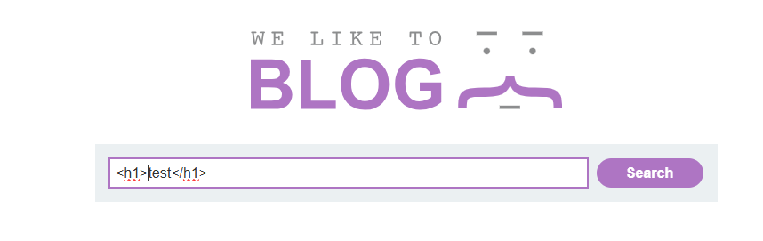
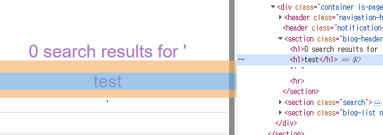
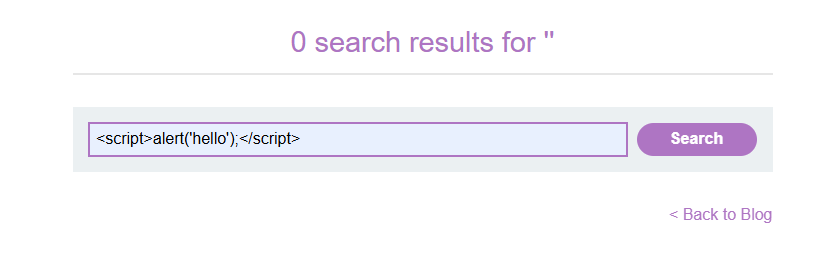
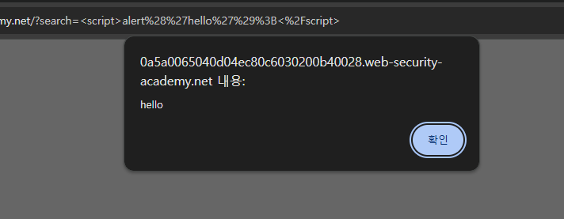

# Lab: Reflected XSS into HTML context with nothing encoded

## 개요
- 취약점: Reflected Cross-Site Scripting (XSS)
- 난이도: Apprentice
- 목표: 검색 기능에 JavaScript Payload 를 삽입하여 XSS 공격 실행

## 공격 흐름
### 1. 검색 http 요청 확인
```http
GET /?search=test HTTP/1.1
```
- 검색 기능 테스트 시 위와 같은 요청이 발생한다.

### 2. 응답(Response) 및 렌더링 확인
- html 태그를 검색어로 입력했을 때 결과로 html 태그가 렌더링 되는 것을 확인할 수 있다.   



### 3. XSS Payload 삽입
```js
<script>alert('hello');</script>
```
- 위와 같이 검색어를 입력하여 검색한다.   


### 4. 결과 확인
```http
GET /?search=<script>alert('hello');</script> HTTP/1.1
```
- 위와 같이 요청되며
- 스크립트 태그가 그대로 실행되어 얼럿을 확인할 수 있다.   


## 원리 분석
### 1. 취약한 구조
- 사용자 입력값이 HTML 에 태그로 그대로 삽입된다.
- 브라우저가 js 를 실행하면서 XSS 가 발생한다.

## 대응 방안
### 1. 출력값 내 html 인코딩
- html 태그를 escape 처리 한다.
```html
&lt;script&gt;alert('hello');&lt;script&gt;
```
- escape 처리 되었기 때문에 브라우저는 단순 문자열로 처리하게 된다.

### 2. 사용자 입력값 검증
- 허용되지 않은 태그 및 스크립트를 제한한다.
- 이때 입력값 최종 검증은 서버에서 수행한다.

## 3. Content Security Policy(CSP) 적용
- 인라인 스크립트 실행을 제한하여 XSS 피해를 줄인다.