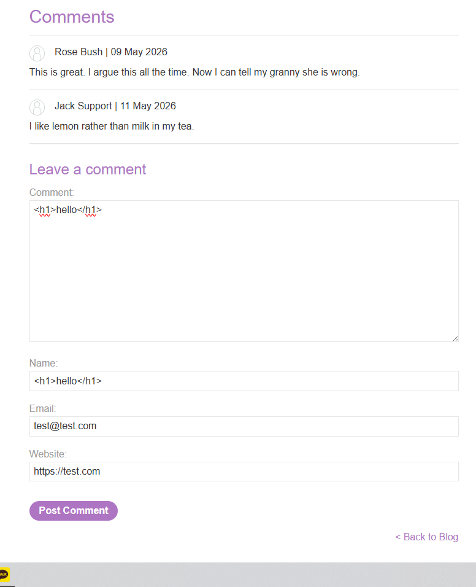
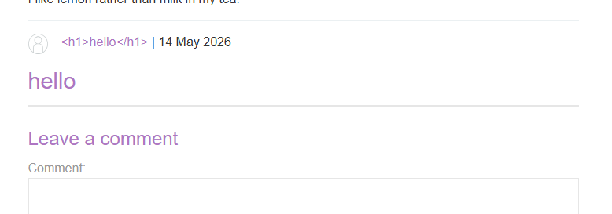
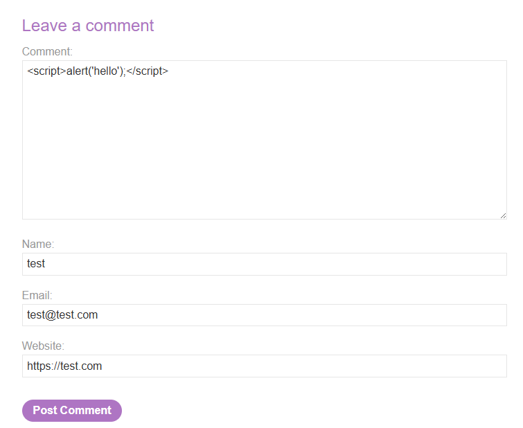
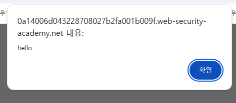

# Lab: Stored XSS into HTML context with nothing encoded

## 개요
- 취약점: Stored Cross-Site Scripting (stored XSS)
- 난이도: Apprentice
- 목표: 댓글 기능에 JS Payload 를 저장하여 XSS 공격 실행

## 공격 흐름
### 1. 댓글 작성 기능 확인
```html
<h1>hello</h1>
```
- 게시글의 댓글 입력 폼에 html 코드를 입력한다.


### 2. 작성한 댓글 렌더링 확인
- html 태그를 입력했을 때 결과로 html 태그가 렌더링 되는 것을 확인할 수 있다.
- 태그가 별다른 필터링 없이 DB에 저장됨을 알 수 있다.


### 3. XSS Payload 삽입
```js
<script>alert('hello');</script>
```
- 위와 같이 코멘트를 입력하여 저장한다.   


### 4. 결과 확인
- 페이지 재접속 시 `alert` 스크립트가 작동한다.   


## 원리 분석
### 1. 취약한 구조
- 사용자 입력값이 서버에 저장된 뒤, 출력 시 escape 등의 별다른 필터링 처리 없이 html 에 포함된다.
- 브라우저가 JS 를 실행하면서 Stored XSS 가 발생한다.

## 대응 방안
### 1. 출력값 내 html 인코딩
- html 태그를 escape 처리 한다.
```html
&lt;script&gt;alert('hello');&lt;script&gt;
```
- escape 처리 되었기 때문에 브라우저는 단순 문자열로 처리하게 된다.

### 2. 사용자 입력값 검증
- 허용되지 않은 태그 및 스크립트를 제한한다.
- 이때 입력값 최종 검증은 서버에서 수행한다.

### 3. Content Security Policy(CSP) 적용
- 인라인 스크립트 실행을 제한하여 XSS 피해를 줄인다.

### 4. HTML Sanitization 적용
- 허용된 태그만 남기고 나머지 태그는 제거한다.
- `DOMPurify`, `sanitiz-html` 등