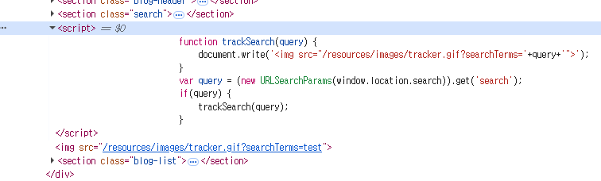
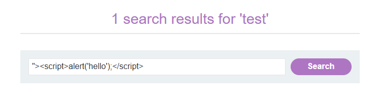
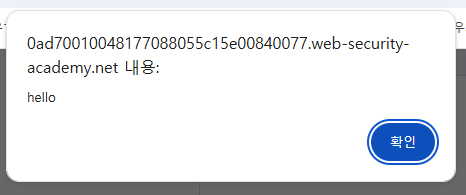

# Lab: DOM XSS in document.write sink using source location.search

## 개요
- 취약점: DOM-baed Cross-Site Scripting (DOM XSS)
- 난이도: Apprentice
- 목표: URL 파라미터를 이용, JS Payload 삽입하여 XSS 공격

## 공격 흐름
### 1. 검색 기능 확인
```http
GET /?serach=test HTTP/1.1
```
- URL 파라미터로 입력 쿼리가 들어가는 것을 확인할 수 있다.

### 2. 페이지 내 JS 코드 분석

- URL 내에서 `search`에 해당하는 파라미터를 추출
- 해당 쿼리가 존재하면 `trackSearch`함수 실행
- `trackSearch` 함수는 img 태그를 생성하여 삽입하는 코드임을 알 수 있다.

### 3. XSS Payload 삽입
```html
"><script>alert('hello');</script>
```


### 4. 결과 확인
- 최종적으로 브라우저에서 다음과 같은 html 이 생성되고, alert 이 실행된다.
```html
<script>alert('hello');</script>
```
- 입력값 중 처음의 `">`로 이미지 태그를 닫기 때문에 스크립트 코드가 해석되면서 alert 이 실행되는 구조이다.


## 원리 분석
### 1. Source 와 Sink
```
Source --> Sink
```
- DOM XSS 는 일반적으로 Source --> Sink 구조로 발생한다.
- Source
  - 사용자 입력값이 들어오는 위치
  - 이 문제에서는 `location.search`에 해당
- Sink
  - 입력값이 위험하게 사용되는 위치
  - 이 문제에서는 `document.write`에 해당
  - html 을 그대로 DOM 에 삽입한다.

## 대응 방안
### 1. document.write 사용 지양
- DOM 조작 함수 사용을 피한다.
- `document.write()`, `innerHTML`, `outerHTML` 등

### 2. 안전한 DOM API 사용
```js
element.textContnet = userInput;
```
- 브라우저가 html 이 아닌 문자열로 인풋을 처리한다.

### 3. 입력값 인코딩 및 검증
- html 특수문자를 escape 처리한다.

### 4. Content Security Policy(CSP) 적용
- 인라인 스크립트 실행을 제한하여 XSS 피해를 줄인다.